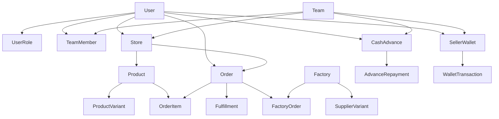

# Database Tables Index

Complete documentation of all database tables in the fulfillment hub system.

## Core System Tables

### User Management
- [User](./user.md) - User accounts and authentication
- [Role](./role.md) - System roles
- [Permission](./permission.md) - Granular permissions
- [UserRole](./user-role.md) - User-role assignments
- [RolePermission](./role-permission.md) - Role-permission mappings

### Team Management
- [Team](./team.md) - Seller teams/organizations
- [TeamMember](./team-member.md) - Team membership

### Authentication
- [Session](./session.md) - User sessions
- [VerificationToken](./verification-token.md) - Email verification

## Business Operations

### Stores & Products
- [Store](./store.md) - Connected e-commerce stores
- [Product](./product.md) - Products from stores
- [ProductVariant](./product-variant.md) - Product variations
- [SystemVariant](./system-variant.md) - Standardized variant codes

### Orders & Fulfillment
- [Order](./order.md) - Customer orders
- [OrderItem](./order-item.md) - Order line items
- [Fulfillment](./fulfillment.md) - Fulfillment tracking
- [FulfillmentItem](./fulfillment-item.md) - Fulfilled items

### Design Management
- [Design](./design.md) - Design assets
- [DesignVariant](./design-variant.md) - Design variations
- [ProductDesign](./product-design.md) - Product-design mappings
- [StoreDesign](./store-design.md) - Store-design associations

### Factory Integration
- [Factory](./factory.md) - Print-on-demand factories
- [FactoryOrder](./factory-order.md) - Production orders
- [FactoryOrderItem](./factory-order-item.md) - Production items
- [SupplierVariant](./supplier-variant.md) - Factory-specific variants
- [FactoryPriceRule](./factory-price-rule.md) - Pricing rules

## Financial System

### Cash Advances
- [CashAdvance](./cash-advance.md) - Advance requests
- [AdvanceRepayment](./advance-repayment.md) - Repayment records

### Wallets & Transactions
- [SellerWallet](./seller-wallet.md) - Seller financial wallets
- [WalletTransaction](./wallet-transaction.md) - Transaction history

### Profit Sharing
- [ProfitShare](./profit-share.md) - Profit distribution
- [Settlement](./settlement.md) - Period settlements

## Analytics & Reporting

### Audit & Logging
- [AuditLog](./audit-log.md) - System audit trail
- [ActivityLog](./activity-log.md) - User activity tracking

### Performance Metrics
- [OrderMetrics](./order-metrics.md) - Order analytics
- [SellerMetrics](./seller-metrics.md) - Seller performance
- [FactoryMetrics](./factory-metrics.md) - Factory performance

## Table Relationships Diagram

## Database Conventions

### Naming Conventions
- Tables: PascalCase (e.g., `UserRole`)
- Columns: camelCase (e.g., `createdAt`)
- Enums: UPPER_SNAKE_CASE (e.g., `ORDER_STATUS`)
- Indexes: table_column_idx (e.g., `user_email_idx`)

### Common Columns
Most tables include:
- `id` - Primary key (CUID)
- `createdAt` - Creation timestamp
- `updatedAt` - Last update timestamp
- `isActive` - Soft delete flag (where applicable)

### Data Types
- IDs: String (CUID)
- Money: Decimal(10,2)
- Percentages: Decimal(5,2)
- Timestamps: DateTime
- JSON: Json (for flexible data)

### Best Practices
1. Use soft deletes (isActive flag) instead of hard deletes
2. Include audit trail for sensitive operations
3. Encrypt sensitive data (tokens, keys)
4. Use database transactions for multi-table operations
5. Create indexes for frequently queried columns